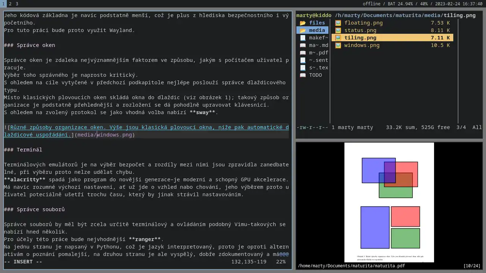

# Clay

Clay is a **functional**, **keyboard-centric desktop environment**. It is based
on SirCmpwn's [sway](https://swaywm.org/) and is meant to be run on top of
[Fedora](https://getfedora.org).

## Motivation

When choosing a distribution, users are usually presented with two options:	

1. fat, clumsy OS that has zero respect for their needs and is broken by design
   (e.g. Ubuntu and friends); or
2. incomplete, DYI distro that is basically unusable out-of-the-box.

As there seems to be no middle option, I have decided to create one myself.
Distributions should be a **minimal**, **no-nonsense way of getting your system
up and running** with as little effort as possible.

## Software

Clay comes with a number of preconfigured programs, all aimed at making your
computing economic and swift. With that said, Clay ships with:

- [icecat](https://en.wikipedia.org/wiki/GNU_IceCat) for browsing the
  web
- [ranger](https://wiki.archlinux.org/title/Ranger) for managing files
- [mpv](https://wiki.archlinux.org/title/Mpv) and
  [newsboat](https://wiki.archlinux.org/title/Newsboat) for media
- [pass](https://wiki.archlinux.org/title/Pass) for password management

Everything is controlled via keyboard, vim-style.
[neovim](https://wiki.archlinux.org/title/Neovim) is the default editor.

## How to Install

After a successful
[minimal](https://able.bio/KY64/minimal-installation-fedora-linux--73410e6d)
installation, go to your `$HOME` directory and do the following:

1. `wget pochutina.mzf.cz/programy/CLAY/archive.tar.gz`
2. `tar xf archive.tar.gz`
3. `sudo sh install_clay`

After that, log out. Next time you log in, you should be automatically booted
into your new Clay environment.[^1]

[^1]: Some things need to be done by a non-root. Please run `post_install` as a
normal user to finish the installation.

## Getting started

There's only two things you need to know:

- `$mod` key is mapped to the left Alt key.
- `$mod+Return` opens your terminal.

Yes, seriously. You can always inspect the files in `~/.config/` to learn about
various bindings etc. or read some man pages.

## ...

Got any questions? Reach out to me via
[e-mail](mailto:mzf@tuta.io).
